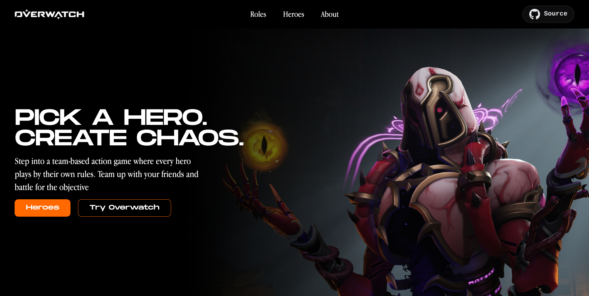

# Overwatch Heroes Directory 🎮

[](https://overwatch-nextjs.vercel.app/)

> ⚠️ **Work in Progress (WIP)**: This project is currently in early active development as a Next.js practice project.

---

## 🔗 Live Links

- **Live Deployment**: [https://overwatch-nextjs.vercel.app/](https://overwatch-nextjs.vercel.app/)
- **Data Source**: [OverFast API](https://overfast-api.tekrop.fr/)

---

## 📖 Project Overview

**Overwatch Heroes Directory** is a web application built with Next.js designed to help newer Overwatch players learn and explore the game's diverse roster of heroes. The goal is to provide a beginner-friendly platform where players can understand hero roles, browse character archetypes, and dive deep into individual hero mechanics and lore.

---

## 📸 Preview



---

## ✨ Features

- [x] **Live API Integration**: Dynamic hero data fetching via the OverFast API.
- [x] **Role-Based Filtering**: Heroes are segregated by core in-game roles:
  - 🛡️ **Tank**
  - ⚔️ **Damage (DPS)**
  - 💉 **Support**
- [ ] **Hero Detail View** *(In Progress)*: Clickable hero cards leading to detailed breakdowns of hero stats, abilities, playstyles, and lore.
- [ ] **Dynamic Search**: Real-time filtering by hero name and archetypes.

---

## 🛠️ Tech Stack

- **Framework**: [Next.js](https://nextjs.org/) (App Router, React Server Components)
- **Library**: [React 19](https://react.dev/)
- **Language**: [TypeScript](https://www.typescriptlang.org/)
- **Styling**: [Tailwind CSS v4](https://tailwindcss.com/)
- **Icons**: [React Icons](https://react-icons.github.io/react-icons/)
- **Hosting**: [Vercel](https://vercel.com/)

---

## 📦 Dependencies

### Core Dependencies
- `next`: `16.3.5`
- `react`: `19.2.8`
- `react-dom`: `19.2.8`
- `react-icons`: `^5.7.0`

### Dev Dependencies
- `tailwindcss`: `^4`
- `@tailwindcss/postcss`: `^4`
- `typescript`: `^5`
- `eslint`: `^9`
- `eslint-config-next`: `16.3.5`

---

## 💻 Getting Started (Local Setup)

Follow these steps to run the project locally on your machine:

### 1. Clone the repository
```bash
git clone https://github.com/Samz6293/overwatch-nextjs
cd overwatch-nextjs
npm install
npm run dev
```